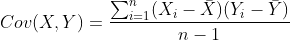

# Dimention Reduction
	Examples of data that often require dimensionality reduction either for visualization or for
	modeling purposes include images, texts, signal processing data, astronomical data, and health
	data. The sklearn.decomposition module includes a number of matrix decomposition algorithms
	including PCA, NMF and ICA. Matrix decomposition has been used for a long time to enable
	dimensionality reduction. One major drawback to using PCA is that non-linear or curved
	surfaces tend to not be well-explained by the approach. Manifold learning for dimensionality
	reduction has gained a lot of traction recently. In particular the t-distributed stochastic
	neighbor embedding (tSNE) family of approaches have become a viable alternative to PCA. It is
	also worth noting that feature selection techniques like using an ANOVA to select K features 
	see SelectKBest ) is also a valid form of dimensionality reduction.
	
	* Feature subsetting: ANOVA, LASSO
	* Matrix decompostion techniques: PCA, SVD
	* Manifold learning techniques: tSNE, isomap
	* dimention reduction in the context of a pipeline: models mau vary in terms of their sensitivity to the class imbalance

	The main goal is to compare and tune different alogorithm available for dimension reduction.

# Feature subsetting
	* AIC/BIC in the context of GLM/GLMMs
	* LASSO regression
	* Neural networks
		1. For labeled data:feature extraction via upper-layer outputs
		2. For labeled or ublabeled data: autoencoders

	* Feature selection:
		1. from sklearn.feature selection import VarianceThreshold
		2. from sklearn.feature selection import SelectKBest
	* Recursive feature elimination

# Principle Component Analysis
	* Latex Formula: Cov(X,Y) = \frac {\sum_{i=1} ^{n} (X_i - \bar{X} ) (Y_i - \bar{Y} )} {n-1}
<!--  -->

	Usually we will get a covariance matrix with a lot of large values.Our ideal would be one
	where all the non-diagonal values are 0. This means that there is no relationship between the
	features. PCA is essentially a transformation of the data to help make this happen.

	Principle components are linear combinations of the original variables.
	

# Other matrix decomposition techniques
	* DictonaryLearning - Dictionary learning
	* FactorAnalysis - Fator Analysis (FA)
	* FastICA - FastICA: a fast algotithm for the Independent Component Analysis.
	* IncrementalPCA - Incremental principal component analysis (IPCA)
	* KernalPCA - Kernal principal component analysis (KPCA)
	* LatentDirichletAllocation - Latent Dirichlet Allocation with online variational Bayes 
	  algorithm.
	* NMF - Non-Negative Matrix Factorization (NMF)
	* SparsePCA - Sparse Principal Components Analysis (SparsePCA)
	* SparseCoder - Sparse coding
	* TruncatedSVD - Dimensionality reduction using truncated Singular Value Decomposition (aka LSA).
	
# Manifold learning:
	Manifold learning algorithms are often used in the context of visualization.
	Principal component analysis and independent component analysis are examples of algorithms
	that define ways to obtain a specific linear projection of the data. These methods have the
	caveat that they do not identify nonlinear structure in the data. Manifold learning is used to
	generalize linear techniques such as PCA to be more sensitive to nonlinear structure in your
	data.  
	* Isomap Isomap Embedding
	* LocallyLinearEmbeddin
	* MDS - Multidimensional scaling
	* SpectralEmbedding - Spectral embedding for non-linear dimensionality reduction.
	* TSNE t-distributed Stochastic Neighbor Embedding.

	t-SNE has a cost function that is not convex. This means that we will not always get the same
	result.It's always highly recommended to use another dimensionality reduction method such as
	PCA for dense data, or truncated SVD for sparse data.To reduce the number of dimensions down
	to a reasonable amount such as 50.

# Topic Modeling
	Latent Dirichlet Allocation (LDA) and non-negative matrix factorization (NMF) are both
	commonly used in the context of topic modeling. Generally, these approaches use a bag-of-words
	representation. These models are in practice a form of dimensionality reduction. The embedding
	approach tSNE is often used to visualize the results of topic model representations in lower
	dimensional space to both tune the model as well as gather insights from the data. The package
	pyLDAvis is specifically purposed with visualizing the results of these models.

	Topic modeling has a number of use cases apart from feature engineering for supervised
	learning. There is utility in being able to organize a large corpus of data. Take for example
	a law firm that has used the same types of forms for decades. Before the form was electronic
	it was simply put in a folder. Now that the forms are electronic they are organized into
	categories. LDA can be used to model the new corpus before the trained model is fed the
	historical documents. The trained model would then make probability estimates for membership
	in the categories.

	Additional resources for topic modeling:
[Applications of Topic Models](https://mimno.infosci.cornell.edu/papers/2017_fntir_tm_applications.pdf)

[LDA was used to extract information from clinical notes](https://researcher.watson.ibm.com/researcher/files/ibm-Uri.Kartoun/srep42282_blei03a.pdf)