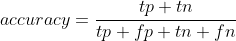
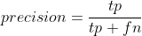

Points from the course: [AI Workflow: Feature Engineering and Bias Detection](https://www.coursera.org/learn/ibm-ai-workflow-feature-engineering-bias-detection)

# Summary:

The data-transformations part of the AI workflow is the first point in the overall process that
explicitly encourages iteration. This stage encompasses all possible transformations of the data,
such as dimensionality reduction, outlier detection, clustering and other forms of unsupervised
learning. Combining these activities into a single process is done mainly because selecting a
suitable transformation or tuning a given transformation takes the same form. That form builds on
the three interfaces of scikit-learn and the container class pipelines.
Transformer interface

    Used to convert data from one form to another

Estimator interface

    Used to build and fit models

Predictor interface

    Used to making predictions

It is worth noting that these interfaces in combinations with pipelines have had such an impact on
the data science workflow that Apache Spark now has similar [ML pipelines](https://spark.apache.org/docs/latest/ml-pipeline.html).

## Class imbalance, data bias:

Imbalanced classes are common especially in specific application scenarios like fraud detection
and and customer retention. The first guideline is to ensure that you do not use accuracy as the
metric as the results can be misleading. Accuracy is the number of correct calls divided by all of
the calls.

<!-- accuracy = \frac{tp+tn}{tp + fp + tn + fn} -->

If our positive class is only a small percentage of the overall data you can see that the model
will be optimized for the negative class. The ability of a model to resolve true positives will
not be well-represented in the metric because it will be overwhelmed by the influence of the
majority class. Metrics based on [precision and recall](https://en.wikipedia.org/wiki/Precision_and_recall) will be more specific to the problem because
TN (true negatives) is not part of the numerator.

<!-- precision = \frac{tp}{tp + fp} -->

<!-- precision = \frac{tp}{tp + fn} -->

The most common approaches to address imbalanced classes are sampling based. Between over-sampling
and under-sampling, under-sampling is conceptually simpler. Given a minority class or classes that
are noticeably underrepresented, you may randomly drop some of those observations from the
training data so that the proportions are more closely matched across classes. A major caveat to
under-sampling is that we are not using all of the data.

Over-sampling techniques come in several forms, from random or naive versions to classes of
algorithms like the Synthetic Minority Oversampling Technique (SMOTE) [1] and the Adaptive
Synthetic (ADASYN) [2] sampling method. There are a number of variants of these over-sampling
algorithms that can be compared.

All of the sampling techniques that we discussed are implemented in the [imbalanced-learn](https://imbalanced-learn.readthedocs.io/en/stable/) Python
package. This package is convenient because it allows for the implementation of multiple sampling
techniques as pipelines. Additionally, it interfaces with TensorFlow and Keras in a convenient way
as well, which is important because neural networks are generally sensitive to class imbalance.
Support Vector Machines (SVM) are an example of a machine learning algorithm that is less
sensitive to imbalanced classes. SVMs can be tuned to accommodate situations with unbalanced class
proportions making them a reasonable tool for outlier detection as well

## Dimentionality Reduction:

Applications of data science that often require dimensionality reduction for visualization or for
modeling purposes are: image analysis, text analysis, signal processing, astronomy, and medicine.
We discuss three main categories of dimensionality reduction techniques: matrix decomposition,
manifold learning, and topic models. The techniques developed for topic models generally fall
under one of the first two categories, but the application is natural language processing. The
principal reasons for considering dimensionality reduction in your workflow are:

	* visualization
    * remove multicolinearity
    * remove redundant features
    * deal with the curse of dimensionality
    * identify structure for supervised learning
    * high-dimensional data

These materials review principal components analysis (PCA), [Non-negative matrix factorization](https://en.wikipedia.org/wiki/Non-negative_matrix_factorization) (NMF) and singular value
decomposition (SVD) as examples of matrix decomposition algorithms. A major drawback to using PCA
is that non-linear or curved surfaces tend to not be well-explained by the approach. An
alternative approach uses manifold learning for dimensionality reduction. Specifically, we discuss
the [tSNE](https://en.wikipedia.org/wiki/T-distributed_stochastic_neighbor_embedding) family of
approaches.

We present NMF and [Latent Dirichlet Allocation (LDA)](https://en.wikipedia.org/wiki/Latent_Dirichlet_allocation) as example methods to carry out topic modeling. The embedding approach tSNE is often used to visualize the results of topic model representations in lower dimensional space to both tune the model as well as gather insight into the data. The package pyLDAvis is specifically purposed with visualizing the results of these models.

* [sklearn.decomposition](https://scikit-learn.org/stable/modules/classes.html#module-sklearn.decomposition)
* [sklearn.manifold](https://scikit-learn.org/stable/modules/manifold.html)