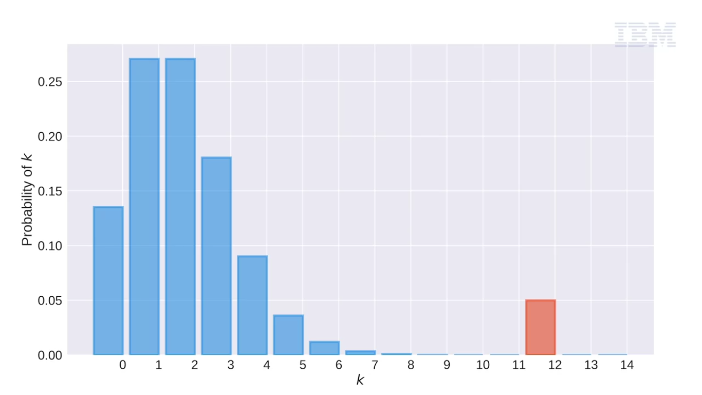
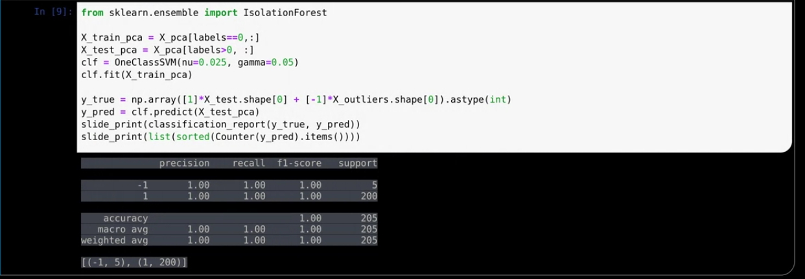

* Outliers are data points or observations that fall outside of an expected distribution or pattern. 

For example, if we were to approximate our data with a Poisson distribution, then the outliers are the observations that do not appear to follow the pattern of a Poisson distribution. The same concept follows if linear regression with a model of choice, and a residual plot indicated that a small minority of observations appear to be different from the majority. For some applications of linear models, the presence of aberrant residuals may violate many uderlying model assumptions such as the assumptions that the observations were taken from a population with a normal distribution. 

The discovery of outliers generally occurs during the EDA stage, and the decision for how to deal with them can have repercussions for the entire workflow, even potentially limiting a project's impact on the business.
The first thing to keep in mind when dealing with outliers is to ensure that they are identified and tracked in a systematic way.
This generally involves Data Visualization where the color scheme on scatter plots and histograms is configured to provide guidance and insight.
We're not limited to one and two-dimensional spaces because techniques like PCA and t-SNE can project high-dimensional data into these more familiar spaces. These visualizations can lead to the important discovery of what constitutes an outlier in a particular dataset.

An observation apparently different from the rest may exist as a true outlier because of instrument errors, like a need for calibration, or human errors such as the mislabeling of samples. There are numerous other reasons, but it's important to note that an apparent outlier may in fact be as valid as the rest of the data. It's important to learn as much as possible about data points that appear to be outliers, and this will likely involve a discussion with domain experts.
In some cases like customer churn analysis, the positive class may exist as an extreme minority, and when class imbalance is severe enough, then even techniques like SMOTE and over-sampling may not suffice. Fortunately, there are outlier detection and novelty detection algorithms that fit this exact type of situation.

Outlier detection is used for systematically identifying observations that are different from the other observations and data we've already collected. Novelty detection is focused on detecting outliers during the process of collecting new data.
The application of the algorithms discussed in this unit can be used in classification, regression, anomaly detection, quality control, and the creation of new features for subsequent machine learning. 

## Outlier Detection: Through the Eyes

Visualizations can help reveal the presence of outliers. Some outliers are representative of
natural variations in the data, while others are the result of mislabeling or another unintended
error. When they have been identified it is important to investigate their origin. This will
generally require talking with the individuals that are close to the data production and data
gathering. There is a good chance that it will require some understanding of the nature of the
data itself. 

Understanding the nature of outliers will require extensive work with not only the data itself but
also the experts in the enterprise who create and work with those data.

The design thinking exercise called Data Understanding is designed to allow a team to do a deep
dive into each potential data source that might be used for machine learning models. As a data
scientist your role during this exercise would be to identify all of the complications associated
with using a particular data source, including the presence of outliers that could skew the
model's results. It will be up to you to ask the domain experts about what sort of outliers might
appear in the data, as well as how common they are.

If you’ve identified outliers in your data, it will be your responsibility to raise them up as an
issue during your team’s playback meetings. At that point you’ll be ready to meet with the domain
experts who can tell you if those outliers will be a problem for you as you build your models.

## Stratergy to find outlier:

Novelty detection algorithms assume that outliers are not present in the training data, and they are concerned with the detection of outliers given new data. If we assume outliers are present in the training data then the algorithm falls into the category of outlier detection. It can be used also for novelty detection once trained. These algorithms come up frequently when dealing with extremely unbalanced data, in a supervised learning context and when models are deployed and there are implemented quality assurance mechanisms.

* Elliptic envelope (Outlier)
* One class SVM (Outlier,Novelty)
* Isolation Forest (Outlier)
* Local Outlier Factor (Outlier,Novelty)

### Notes:
* Outlier detection for the elliptic envelope may break or not perform well in high-dimensional settings (Use dimension reduction first)
* One Class SVM requires the choice of a kernel and a scalar parameter to define the boundary.
* Local Outlier factor works well on the high dimensional datasets for by outliers and Novelty.
* Isolation forests works like Random Forests with many single decision stumps. There are several tunable parameters as well.

* The Elliptic envelope may break or not perform well in high-dimensional settings. For example, where N is less than P, P being the number of dimensions. However, you can use PCA or another dimension reduction technique first. For the One Class SVM, the radial basis function kernel is usually chosen, although it needs to be manually tuned. All of the methods will need to be adjusted or tuned to work for your data. For this reason, visualization becomes an essential way to ensure it is working as expected. 

*  The PCA and TSNE embeddings both clearly resolve the outliers as being different. It also appears that TSNE has resolved more of the data structure given the number of groupings. Investigation with more specifically labeled plots could help us understand the nature of the different groups in both plots. In this example, we trained and evaluated the detection algorithm in PCA space, but sometimes the original feature space is best. Note that TSNE is great for visualization, but PCA is a more stable projection which is important for a consistent threshold. 

* There are times when the class imbalance is so extreme that we should consider outlier detection algorithms in place of more traditional supervised learning techniques. Visualization is often used to help determine which algorithm(s) makes the most sense for the data. For high-dimensional data it is sometimes necessary to pipe the data through a dimension reduction algorithm before applying the outlier detection algorithm. In addition to how you scale the data, there is the choice of dimension reduction algorithm and the choice of outlier detection algorithms. 

Moreover, there are generally parameters that modify these outlier detection algorithms, like an assumed level of contamination. Given the number of tuneable components it can take some time through grid-searching and iteratively comparing pipelines to settle on an outlier detection pipeline that is optimized for your data and business opportunity. Outlier detection can also be included as a step in the overall modeling pipeline which can improve performance of the core prediction algorithm, but the outlier observations should still be accounted for in some way.

###Important: 
Outlier detection algorithms can be useful in the case of extreme imbalance among classes. After all, they are intended for use in situations where one class completely overwhelms the other. However, there is no set rule about a given proportion that acts as a switch-point from re-sampling techniques to outlier detection. Iterative comparison based on model performance is generally accepted as the way of choosing a direction.

### Additional Resources:

[Compare the effect of different scalers on data with outliers](https://scikit-learn.org/stable/auto_examples/preprocessing/plot_all_scaling.html#sphx-glr-auto-examples-preprocessing-plot-all-scaling-py)
[Outlier detection on the Boston housing data](https://joomik.github.io/Housing/)
[Customized sampler to implement an outlier rejections estimator](https://imbalanced-learn.readthedocs.io/en/stable/auto_examples/plot_outlier_rejections.html)